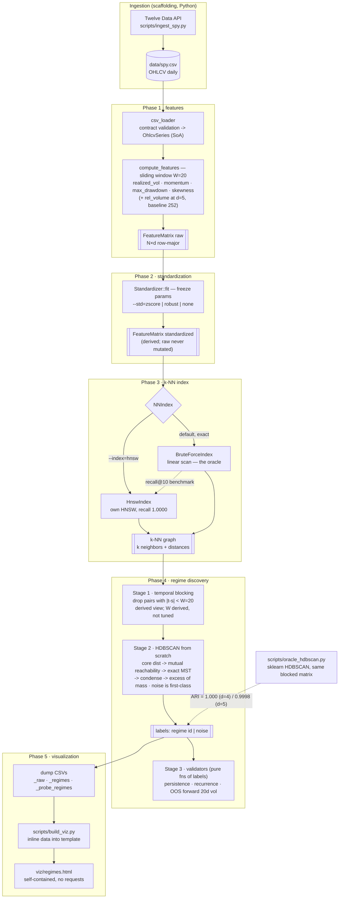
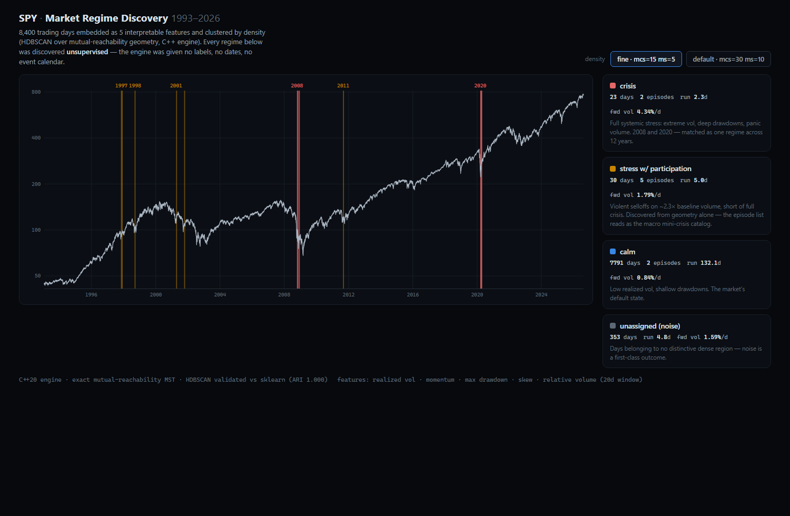

# regime-discovery-cpp

Unsupervised discovery of market regimes: each trading day is embedded as a
feature vector over a trailing window, the vectors are indexed with HNSW, and
regimes emerge as dense regions of the feature space — no labels.

C++20 core. Data ingestion (Twelve Data → CSV) and visualization (HTML) are
scaffolding outside this codebase.

Author: **Cristian Mendoza** · [openbeta.finance](https://openbeta.finance)
· licensed **AGPL-3.0-or-later** (see [License](#license))

## Pipeline



## Phase 1: feature computation ✅

For each day `t` (0-based, first valid `t = 20`), a feature vector over the
trailing 20 log returns `r_{t-19}..r_t` (requires closes `C_{t-20}..C_t`):

| column | definition | units |
|---|---|---|
| `realized_vol` | sample std (ddof=1) of window returns | daily, not annualized |
| `momentum` | Σ rᵢ = ln(C_t / C_{t-20}) | window log return |
| `max_drawdown` | min_j ln(C_j / max_{i≤j} C_i) over window closes | log, ≤ 0 |
| `skewness` | bias-corrected sample skew of window returns | dimensionless |

**No-lookahead guarantee.** Row `t` is computed exclusively from spans ending
at index `t` (structural, see `compute_features`), and verified end-to-end by
a truncation test: truncating the series after day `t` must reproduce row `t`
bit for bit. Output is additionally cross-checked against an independent
pandas/scipy implementation (agreement ~1e-14).

## Phase 2: standardization ✅

`Standardizer` (in `include/mrd/standardize.hpp`) is a whole-matrix primitive:
`fit()` learns and freezes parameters, `transform()` produces a **derived**
matrix (raw is never mutated). Whole-matrix granularity is deliberate — it is
the only interface that can also express future causal/expanding modes; a
stateless per-row apply cannot represent position-dependent standardization.

Implementations, selected via `--std=zscore|robust|none` (factory
`make_standardizer`, nothing hardcoded):

- `ZScoreGlobal` — per-feature (x−μ)/σ, ddof=1, full-sample moments.
- `ZScoreRobust` — (x−median)/(IQR/1.34898), numpy-compatible linear-interp
  quantiles; the 2·Φ⁻¹(0.75) factor makes the scale σ-consistent under
  normality so both variants are comparable.

Deferred by design: `transform_row` (live single-row apply against frozen
params) and causal/expanding standardization.

### Decision record (measured on SPY 1993–2026, 8428×4)

- **Standardization is a measured necessity, not a default**: raw scales are
  catastrophically uneven — by std dev, skewness is ~102× wider than
  realized_vol. Unstandardized Euclidean distance would be dominated by
  skewness almost entirely.
- **No whitening (evaluated and deferred)**: features are strongly correlated
  (realized_vol↔max_drawdown −0.86, momentum↔max_drawdown +0.72), so
  per-feature z-score leaves the shared vol/momentum/drawdown "stress"
  direction counted ~3× in the metric. Accepted deliberately: multi-faceted
  stress is genuine market signal, and whitening would destroy the
  interpretability that motivated interpretable features in the first place.
- **Global lookahead, explicitly accepted**: `ZScoreGlobal` scales every row
  by full-sample moments, so row t depends on data after t. Legitimate for
  the current descriptive goal (regimes relative to the full-sample
  distribution); **not valid for live/predictive use** — that requires a
  causal `Standardizer`, which the interface already accommodates.
- **Robust variant motivated by fat tails**: skewness min −3.36 vs p1 −1.85;
  classic z-score lets those outliers inflate σ and compress the bulk.
  `ZScoreRobust` is the swappable answer.
- **Degenerate features fail loudly**: ~zero σ or IQR at `fit()` throws — a
  constant feature over decades is a data bug, and mapping it to 0 would hide
  a dead dimension inside the index metric.

## Phase 3a: nearest-neighbor index + inspection ✅

`NNIndex` (in `include/mrd/nn_index.hpp`): k-NN over the standardized matrix,
Euclidean metric, two implementations behind one interface:

- `BruteForceIndex` — exact linear scan. The oracle and the default for all
  science: at d=4 there is no curse of dimensionality and a query is ~33 µs,
  so exact search is both feasible and correct.
- `HnswIndex` — own HNSW implementation (hierarchical layers, exponential
  level assignment, greedy descent, diversity heuristic with pruned fill-back,
  deterministic seeded build). Portfolio infrastructure, included because it
  can be **measured** against the oracle.

Self-exclusion is explicit (`exclude` = row index): implicit distance-0
exclusion was rejected because two distinct days with identical vectors are
regime structure, not artifacts.

CLI subcommands: `features`, `neighbors --date=`, `crisis`, `bench`,
`dump-nn` (writes `<prefix>_neighbors.csv`, long format
`index,date,rank,neighbor_index,neighbor_date,distance`).

### Measured results (SPY 1993–2026, N=8428, d=4, k=10, all rows as queries)

| | build | query mean | query p99 | recall@10 |
|---|---|---|---|---|
| BruteForce | 53 µs | 33.3 µs | 58 µs | 1.0 (oracle) |
| HNSW (M=12, efC=200, efS=64) | 286 ms | 8.97 µs | 18.3 µs | **1.0000** |
| HNSW (efS=16) | 286 ms | 2.91 µs | 6.6 µs | 1.0000 |

Honest reading, recorded deliberately: HNSW achieves perfect recall and ~4–11×
query speedup, but at N=8.4k/d=4 brute force was already microseconds — the
approximate index is not needed here and exists as measured infrastructure.

### Regime-structure validation (the science)

`mrd crisis` prints exact neighbors of hardcoded stress days. Result: every
crisis day's nearest neighbors are exclusively other crisis days, with
**cross-crisis matching** — 2008-10-10 (Lehman peak: vol 3.5%/day, momentum
−35% over the window) has seven of its eight nearest neighbors in March 2020.
Within 2008, panic days (2008-10-10) and rebound-chop days (2008-11-20, high
vol + positive skew) separate into distinct neighborhoods. The feature space
encodes regime structure; Phase 1+2 is validated.

## Phase 4: regime discovery (density clustering) ✅

Three independently swappable stages (`mrd regimes <csv> [prefix]`):

1. **Temporal blocking** (`neighbor_graph.hpp`) — derived view of the k-NN
   graph excluding neighbors with |t−s| < W=20. W is DERIVED, not tuned: it
   is the Phase 1 window width, the lag at which window overlap reaches zero.
   The raw graph stays untouched (raw-vs-derived discipline). The blocking
   applies to the ENTIRE clustering input — core distances AND the MST edge
   set (the `NeighborGraph` carries its `block_window` as metadata).
2. **HDBSCAN from scratch** (`hdbscan.hpp`) — core distances from the blocked
   graph's (min_samples−1)-th neighbor, mutual reachability, exact MST,
   single-linkage condensation, excess-of-mass extraction with noise as a
   first-class outcome. Validated sub-pieces + end-to-end oracle.
3. **Validators** (`regime_validate.hpp`) — persistence (mean run length),
   recurrence (temporally disjoint episodes at gap>60), OOS forward 20d
   realized vol by regime. Pure functions of the final labels; never look at
   the blocked graph (no circularity).

**Oracle**: `scripts/oracle_hdbscan.py` runs sklearn HDBSCAN on the same
standardized matrix with the same inf-blocked precomputed distances.
**ARI(C++ labels, sklearn labels) = 1.000 on SPY 1993–2026** — exact
agreement, same role brute force played for HNSW.

### Phase 4 decision record (measured)

- **k-NN substrate MST rejected after measurement**: the MST restricted to
  k-NN edges misses portal edges between dense regions (a cluster-edge
  point's k neighbors are all interior, so the true inter-cluster bridge
  enters the edge set only when k ≈ cluster size). On the blob fixture the
  two blobs merged at 16.6 through a noise chain instead of the true 6.0
  bridge — merge heights distorted exactly where regime structure lives.
  Default is exact implicit-matrix Prim (O(N²), sub-second at N=8428); the
  substrate variant survives as `--mst=substrate` for comparison. The k-NN
  graph still feeds HDBSCAN through core distances.
- **min_samples counts the point itself** (core distance = (min_samples−1)-th
  other neighbor), matching sklearn and the hdbscan library's primary path.
  The mcinnes precomputed path counts one more; this off-by-one cost an ARI
  of 0.75 until pinned down.
- **Blocking must cover the MST too**: blocking only the core distances let
  window-overlap pairs back in as tree edges (ARI 0.93); extending the same
  exclusion to MST edges closed the gap to 1.0 — and is the conceptually
  right reading of Stage 1 (sanitize the entire clustering input).

### Validation results on SPY (defaults: mcs=30, min_samples=10)

| id | days | mean run | episodes | fwd 20d vol (med) |
|---|---|---|---|---|
| noise | 4315 | 7.8 | – | 0.0106 |
| 2 (calm) | 3997 | 8.0 | 15 | **0.0068** |
| 0, 1, 3 | 30–50 | 1.5–1.9 | 7–14 | 0.010–0.015 |

Honest reading: **one regime is real** — the calm regime: persistent (8-day
runs), recurrent (15 disjoint episodes across 33 years), and predictive
(forward vol ~36% below the noise group). The three micro-clusters recur but
do not persist (runs < 2) — marginal. The 2008/2020 crisis days are all
labeled noise at these parameters.

Probe at sharper density (min_samples=5, mcs=15): a **crisis regime emerges**
— 35 days in exactly **2 episodes: Oct 2008 and Mar–Apr 2020**, forward vol
median 0.0298 vs 0.0084 for the rest (3.5×) — the strongest economic-content
signal in the run; the most extreme days (2008-10-10, 2020-03-16/23) remain
noise (the tail of the tail). Conclusion per the calibration expectation:
the 4-feature space robustly separates calm vs stress, but does not support
fine-grained multi-regime structure at a single parameterization — more
features (volume, term structure) are the likely path, not more tuning.

## Phase B: volume feature experiment (d=4 → d=5) ✅

Controlled single-variable experiment: add exactly one feature, hold
everything else constant, let the three validators decide.

**Step 0 (raw volume inspection)**: no zeros/negatives/NaN in 8448 rows (log
is safe). Median annual volume 138k (1993) → 257M (2008, 1856×) → 68M (2025):
the secular trend is huge and NON-monotonic, so only an adaptive rolling
baseline can absorb it — no parametric detrend. 1993–1995 is thin-liquidity
(8 days < 20k shares); the 252d warm-up skips most of it.

**Feature**: `rel_volume[t] = ln( mean(v[t-19..t]) / mean(v[t-251..t]) )` —
window volume over a trailing 1-year baseline, both ending at t (zero
lookahead, covered by the bitwise truncation test for both d=4 and d=5).
Baseline 252 is a judgment call (tunable, not tuned). The log tames the fat
right tail so well that robust vs classic σ differ by only 6% (ratio 1.06) —
unlike skewness, classic z-score is unproblematic here (decision record).

d=5 warm-up moves the first row to day 251 (N=8197, from 1994-01-26), so the
controlled comparison runs d=4 on the SAME sample via `--warmup=251`.
Canonical d=4 (N=8428) remains the default and reproduces Phase 4 exactly.
Oracle re-run at d=5: **ARI = 0.9998** (sklearn, same blocked matrix).

### Correlation (raw, Pearson): did volume open a new axis?

rel_volume vs: realized_vol **+0.51**, max_drawdown **−0.51**, momentum
−0.33, skewness −0.05. Half-new axis: ~26% shared variance with the stress
direction — volume co-moves with vol but carries an independent
participation component.

### Verdict (d=4 aligned vs d=5, same sample, same params)

- **Defaults (mcs=30, ms=10)**: d=4's two non-persistent micro-clusters
  (mean runs 1.5–1.9) **die** at d=5 — volume prunes artifacts. Structure:
  2 clusters — the calm regime (3783d, run 8.6, 11 episodes, fwd vol median
  0.0069) plus one 32-day micro-cluster that gets slightly more persistent
  (run 1.9→2.5) and more predictive (fwd vol median 0.0139 vs 0.0107 noise).
  The calm/stress conclusion is confirmed and cleaner.
- **Probe (ms=5, mcs=15)**: the 2008+2020 crisis regime survives (23d,
  2 episodes, fwd vol median 0.0434 vs 0.0084 base — 5×), and a **genuinely
  new regime appears that d=4 cannot see**: 30 days in **5 disjoint
  episodes — Oct–Nov 1997 (Asia), Sep 1998 (LTCM), Apr & Oct 2001, Aug 2011
  (US downgrade)** — signature: elevated vol (2.7%/d), moderate drawdown
  (−13%), negative skew, and **rel_volume +0.84 (≈2.3× baseline volume)**.
  Persistent (mean run 5.0), recurrent (5 epochs over 14 years), predictive
  (fwd vol median 0.0179, ~2.1× base): passes all three validators. A
  "stress-with-participation" regime — panic-adjacent selloffs distinct from
  the full 2008/2020 crises.

Both outcomes landed: the d=4 conclusion strengthened at defaults AND a new
validated regime emerged at fine density — volume is signal, not redundancy.
Still true: fine multi-regime structure needs the ms=5 probe; it is not yet
robust at a single default parameterization.

## Phase 5: visualization layer ✅



`viz/regimes.html` — a single self-contained HTML file (no build system, no
external requests, ~570KB with the data inlined): SPY 1993–2026 on a log
scale with regime bands over the timeline. The calm regime is deliberately
unshaded at fine density — the dark background IS the market's default state;
only stress lights up. Built from `viz/regimes.src.html` by
`scripts/build_viz.py` (merges the engine's CSV dumps and inlines them); the
source template also works served (`python -m http.server` → fetches the
CSVs) or via drag-and-drop on `file://`.

- **Layer 1 (figure)**: price + regime bands + named legend. 2008, 2020 and
  the 1997/1998/2001/2011 group light up with year labels — no interaction
  needed.
- **Layer 2 (tool)**: density toggle (default mcs=30/ms=10 vs fine
  mcs=15/ms=5 — the two resolutions the engine produces), crosshair hover
  with the day's 5 raw feature values and regime, click-to-select a regime →
  episodes highlighted and listed with hand-annotated macro events (Asian
  crisis, LTCM, dot-com unwind, post-9/11, US downgrade — names attached
  AFTER discovery; the engine grouped the dates from geometry alone).

Regime colors are categorical palette slots validated with the six-checks
dataviz validator against the dark surface (all PASS, CVD-safe). Inputs:
`spy.csv`, `features_spy5_raw.csv`, `features_spy5_regimes.csv`,
`features_spy5_probe_regimes.csv` — no C++ changes were needed for this phase.

## Layout

- `include/mrd/types.hpp` — `OhlcvSeries` (SoA), `Feature` enum, `FeatureMatrix`
  (row-major N×d contiguous + aligned date vector; `row(t).data()` feeds HNSW
  directly, no copy)
- `include/mrd/features.hpp`, `src/features.cpp` — window kernels + sliding-window driver
- `include/mrd/standardize.hpp`, `src/standardize.cpp` — `Standardizer` interface,
  `ZScoreGlobal`, `ZScoreRobust`, factory
- `include/mrd/nn_index.hpp`, `src/brute_index.cpp`, `src/hnsw_index.cpp` —
  `NNIndex` interface, exact oracle, HNSW
- `include/mrd/neighbor_graph.hpp`, `src/neighbor_graph.cpp` — materialized
  k-NN graph + temporal blocking (Stage 1)
- `include/mrd/hdbscan.hpp`, `src/hdbscan.cpp` — HDBSCAN from scratch (Stage 2)
- `include/mrd/regime_validate.hpp`, `src/regime_validate.cpp` — persistence,
  recurrence, OOS forward vol (Stage 3)
- `include/mrd/csv_loader.hpp`, `src/csv_loader.cpp` — validated OHLCV load, feature dump
- `src/main.cpp` — CLI: `mrd <ohlcv.csv> [features_out.csv]`
- `tests/` — doctest suite: kernel values vs scipy fixtures, alignment,
  momentum telescoping, no-lookahead truncation, loader validation

## Build (WSL / Linux)

```sh
cmake -S . -B build -DCMAKE_BUILD_TYPE=Release
cmake --build build -j
./build/mrd_tests                              # run tests
./build/mrd features  data/spy.csv out         # -> out_raw.csv, out_std.csv
./build/mrd crisis    data/spy.csv -k 8        # regime validation, eyeball it
./build/mrd neighbors data/spy.csv --date=2008-10-10
./build/mrd bench     data/spy.csv [--ef=N]    # recall + latency vs oracle
./build/mrd dump-nn   data/spy.csv out -k 10   # -> out_neighbors.csv
./build/mrd regimes   data/spy.csv out         # -> out_regimes.csv + validation report
./build/mrd regimes   data/spy.csv out --d=5   # d=5 (volume feature); --warmup=251 aligns d=4
```

## Data ingestion (scaffolding)

`scripts/ingest_spy.py` downloads full SPY daily history from Twelve Data
(paginated past the 5000-bar request cap) into `data/spy.csv`, validating the
exact contract the C++ loader enforces before writing. Requires
`TWELVEDATA_API_KEY` in the environment.

## Roadmap

- Feature expansion (range-based / Parkinson vol) to resolve stress sub-regimes
- Causal (expanding-window) `Standardizer` for a live/predictive setting
- Multi-instrument regime comparison (same engine, different tickers)

## License

Copyright © 2026 Cristian Mendoza ([openbeta.finance](https://openbeta.finance)).

Licensed under the **GNU Affero General Public License v3.0 or later**
(AGPL-3.0-or-later). The full text is in [LICENSE](LICENSE).

In short: you may use, study, modify and redistribute this code, but any
derivative work must remain under the AGPL and keep this attribution — and if
you run a modified version as a network service, you must offer its source to
the users of that service. Attribution means retaining the copyright notice
and crediting **Cristian Mendoza — regime-discovery-cpp**, with a link to this
repository.

For use under different terms (including proprietary or closed-source use),
contact the author: commercial licensing is available.

### Third-party components

- [doctest](https://github.com/doctest/doctest) (`third_party/doctest.h`) — MIT
  License, © Viktor Kirilov. Vendored unmodified for the test suite.
- Reference/validation only, not linked into the engine: NumPy, SciPy,
  pandas, scikit-learn (BSD-3-Clause).

The HNSW and HDBSCAN implementations here are original work written from the
published algorithm descriptions (Malkov & Yashunin 2016; Campello, Moulavi &
Sander 2013) — no third-party implementation code was copied.
